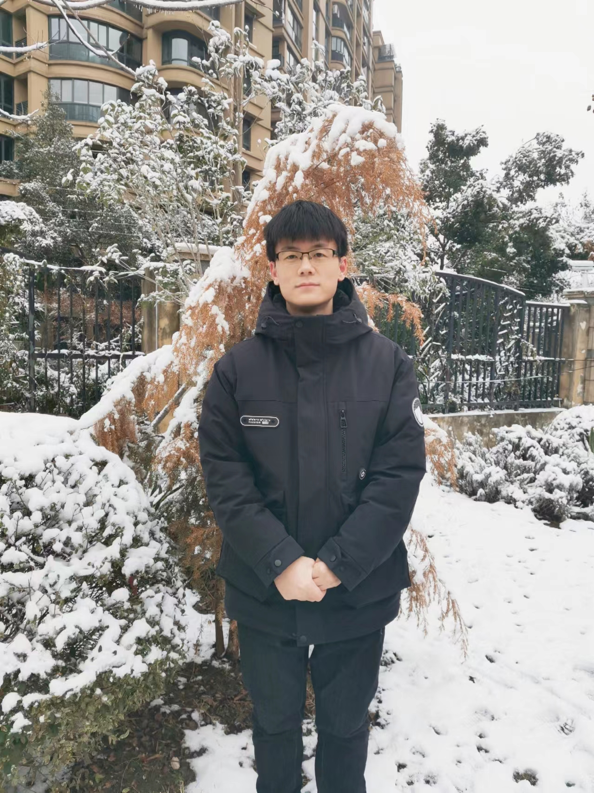

# ysn-hu.github.io

---
**Yasen Hu**
  - Position: Postdoctor Research Fellow
  - Email: ysenhu@ustc.edu.cn
  - Address: University of Science and Technology of China, Hefei 230027, China
    
---

## Education & Career

- **University of Science and Technology of China**
  ~ Hefei 230027, China

  - Postdoctor Research Fellow
  ~ from 07/2023 to now

- **University of Science and Technology of China**
  ~ Hefei 230027, China

  - Ph.D. in Fluid Mechanics
  ~ 09/2018 - 06/2023

- **Harbin Engineering University**
  ~ Harbin 150001, China

  - B.Eng. in Aircraft Design and Engineering
  ~ 09/2014 - 06/2018

## Research insterests

- Turbulence simulation and Noise control

- High-Performance Computing

## Publications

### Under review

- **Y.-S. Hu**, Z.-H. Wan*, P.-J.-Y. Zhang, D.-J. Sun*, X.-Y. Lu. The correlations between permeability and turbulent structures in compressible channel flows over porous walls. Submitted.

### 2024

- **Hu, Y. S.**, Wan, Z. H.*, Sun, D. J., & Lu, X. Y. (2024). Composite control of airfoil broadband noise based on the combination of porous material and serrated trailing edges. Physics of Fluids, 36(2), 025118.

- Yu, F.-Y., Wan, Z.-H., **Hu, Y.-S.**, Sun, D.-J., & Lu, X.-Y. (2024). Analysis of wavy leading-edge noise reduction and source mechanism in rod-airfoil interactions. Physics of Fluids, 36(4).

- **胡亚森**,张彭俊燚*,庄国徽,万振华,孙德军(2024). 小攻角下锯齿尾缘翼型噪声控制与机理分析[J]. 实验流体力学, 38(1): 28-36

### 2022

- **Hu, Y. S.**, Wan, Z. H.*, Ye, C. C., Sun, D. J., & Lu, X. Y. (2022). Noise reduction mechanisms for insert-type
serrations of the NACA-0012 airfoil. Journal of Fluid Mechanics, 941, A57.

- **Hu, Y. S.**, Zhang, P. J. Y., Wan, Z. H.*, Liu, N. S., Sun, D. J., & Lu, X. Y. (2022). Effects of trailing-edge serration shape on airfoil noise reduction with zero incidence angle. Physics of Fluids, 34(10),105108.

## Chaired Projects

- Natural Science Foundation of China

- Postdoctoral Fellowship Program of CPSF

- China Postdoctoral Science Foundation

## Other Links

[Aero3DX](./Aero3DX.md)

[Profiles in USTC](https://faculty.ustc.edu.cn/huyasen/zh_CN/zhym/742020/list/index.htm)

